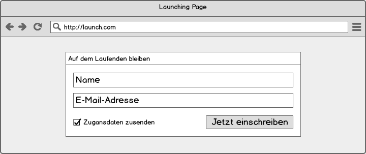

## Aufgabe

Es soll eine Seite entwickelt werden, über die interessierte Besucher ihren Namen und ihre E-Mail-Adresse hinterlassen können, um später über den Start unseres Produktes informiert zu werden. Zudem soll auch eine Checkbox vorhanden sein, um anzugeben, ob auch gleich ein Account angelegt werden soll, oder nicht. Die Daten werden intern in einer CSV-Datei gespeichert.



## Einstieg

Gegeben ist ein Beispiel-Layout (siehe `beispiellayout.html`), um das herum wir die gewünschte Funktionalität bauen.

Im einfachsten Fall ließe sich das Ganze mit einer Zeile erledigen:
<br><small>(Wobei man fast alles in einer Zeile schreiben könnte, ist halt nur nicht schön.)</small>

```php
<?php file_put_contents('subscriptions.csv', "\n{$_POST['username']}, {$_POST['email']}, {$_POST['create_account']}, " . time(), FILE_APPEND); ?>
```

Allerdings ist diese Variante recht unsicher und gibt dem Benutzer kein Feedback. Zwei Dinge, auf die wir Wert legen.

Überprüfen wir also zuerst, ob überhaupt Daten mitgeschickt wurden (andernfalls nehmen wir an, es handelt sich um den initialen Aufruf und machen nichts weiter.) Das lässt sich einfach umsetzen, indem wir prüfen, ob das Array `$_POST` vorhanden ist. Darin werden alle Parameter und deren Werte gehalten, wenn sie über HTTP-POST übertragen wurden.

```php
if ($_POST) { … }
```

## Data Sanitization & Validation

Ist das der Fall, nehmen wir an, dass unser Formular versendet wurde und versuchen, die entsprechenden Daten auszulesen. Dabei wenden wir gleich die von PHP gegebene Funktion [`filter_var`](http://php.net/manual/en/function.filter-var.php) an. Diese erlaubt es uns, Daten um ungewollte Zeichen (beispielsweise HTML-Code) zu bereinigen oder auf bestimmte Muster hin zu prüfen. (Siehe: [Types of filters](http://php.net/manual/en/filter.filters.php))

```php
$username = filter_var($_POST['username'], FILTER_SANITIZE_SPECIAL_CHARS);
$email = filter_var($_POST['email'], FILTER_SANITIZE_EMAIL);
$create_account = (int) filter_var($_POST['create_account'], FILTER_VALIDATE_BOOLEAN);
$is_email_valid = $email && filter_var($email, FILTER_VALIDATE_EMAIL);
```

## Umgang mit Dateien

Da wir unseren Daten nun besser vertrauen können, kümmern wir uns darum, sie zu speichern. Wir überprüfen per `file_exists($filename)`, ob unsere CSV-Datei vorhanden ist. Sollte das nicht der Fall sein, können wir sie über `file_put_contents($filename, $content)` anlegen und gleich mit der passenden Kopfzeile befüllen. Liegen letztlich Benutzername und eine valide E-Mail-Adresse vor, öffnen wir (erneut) unsere CSV-Datei und speichern die Daten weg.

```php
$file = fopen($filename, 'a');
$values = array($username, $email, $create_account, time());
fputcsv($file, $values);
fclose($file);
```

Die Funktion `fputcsv` gibt die Länge der geschriebenen Daten oder `FALSE` zurück. Diese Information kann benutzt werden, um den Benutzer darauf hinzuweisen, ob seine Daten erfolgreich gespeichert werden konnten.

## Userfeedback

Sehen wir uns drei Arten von Feedback an:

- Anzeigen bereits übermittelter Daten
- Hinweise auf Fehler
- Hinweis bei Erfolg

Ersteres lässt sich realisieren, indem die übermittelten Werte wieder in das Formular geschrieben werden:

```html
<input type="text" class="form-control" name="username" value="<?= $username ?>" placeholder="Name">
```

Auf fehlende oder fehlerhafte Eingaben können wir in unserem Fall über [entsprechende, bereits in Bootstrap enthaltene, Klassen](http://getbootstrap.com/css/#forms-control-states) hinweisen, beispielsweise `.has-error`:

```php
$username_class = 'form-group';
if (!$username) $username_class .= ' has-error';
...
<div class="<?= $username_class ?>">
```

Zu guter Letzt können wir auch ganze HTML-Blöcke nur unter bestimmten Bedingungen ausgeben, beispielsweise wenn die Daten erfolgreich gespeichert wurden:

```php
<?php if (isset($success)) : ?>
<div class="alert alert-success">
   <strong>Erfolgreich eingetragen.</strong> Danke für dein Interesse!
</div>
<?php endif; ?>
```